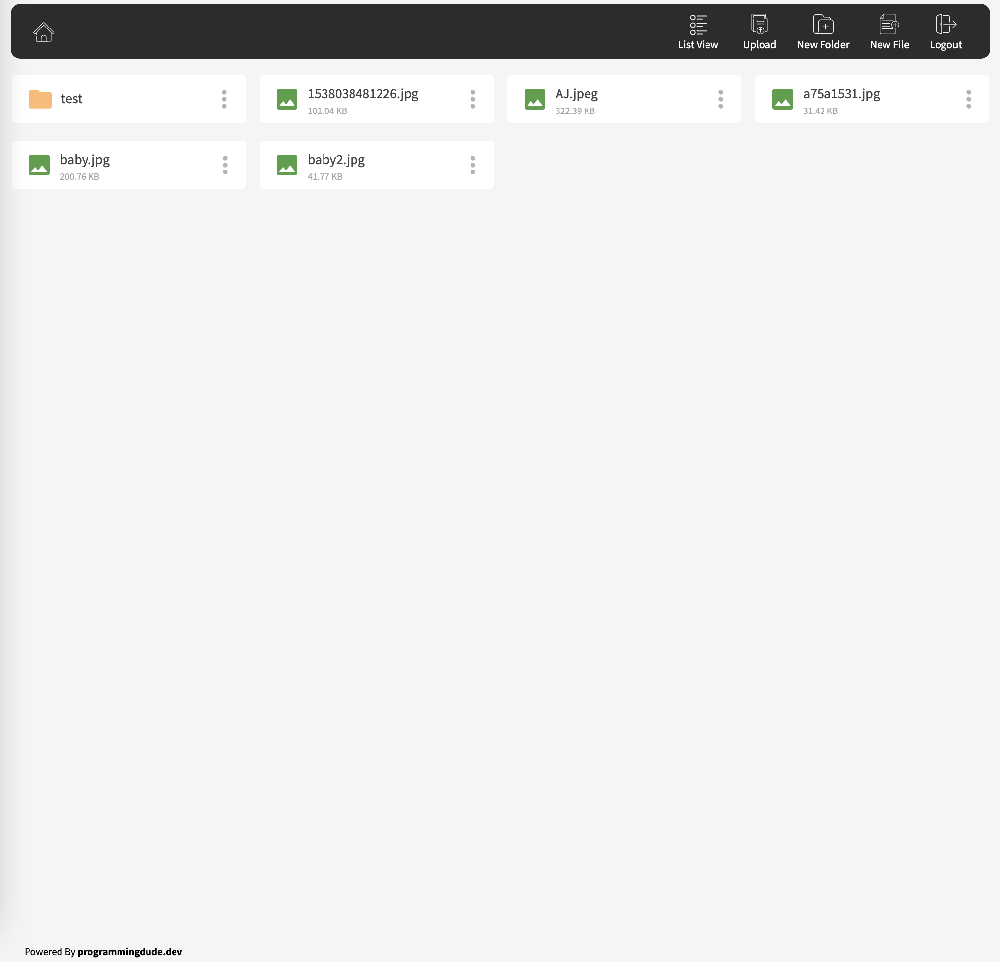

# PHP File Explorer

#### There are 2 branches

- 1. master (for local storage) `git checkout master`
- 2. aws-explorer (for AWS S3 storage) `git checkout aws-explorer`

How to install

step 1. 

`git clone https://github.com/necessarylion/php_file_explorer.git`

step 2. 

- use local storage

`git checkout master`

or 

- use AWS S3 storage

`git checkout aws-explorer`

step 3. 

`composer install`

step 4. 

if you use local storage 
create storage folder 

`mkdir storage`
`sudo chmod 777 -R storage`

### Password (admin)